# Bayesian Deep Learning and Approximate Bayesian Computation for parameter inference


``` r

# Install ABCNeuralNet
devtools::install_github("ThomasBrazier/abcneuralnet")

# Install C++ dependencies of torch (e.g. CUDA, lantern)
torch::install_torch()
# After installing torch CUDA dependencies, the R session must be reloaded
```

``` r

library(abcneuralnet)
library(ggplot2)
library(torch)
library(tidyverse)
library(kableExtra)
```

## Introduction

Approximate Bayesian Computation (ABC) has emerged as a powerful
framework for parameter inference in complex statistical models where
likelihood functions are intractable. However, traditional ABC methods
face significant computational challenges when dealing with
high-dimensional summary statistics and complex parameter spaces. This
vignette presents **abcneuralnet**, an R package that integrates
Bayesian deep learning with ABC to address these challenges. We
demonstrate four methodological approaches: Concrete Dropout (Gal et al.
2017), Monte Carlo Dropout (Gal and Ghahramani 2016), Deep Ensemble
(Lakshminarayanan et al. 2016), and TabNet-ABC (Arik and Pfister 2020;
Åkesson et al. 2022). Each method provides different strategies for
uncertainty quantification and parameter inference, combining the
representational power of deep neural networks with principled Bayesian
inference. Through comprehensive examples, we illustrate the theoretical
foundations, practical implementation, and performance characteristics
of these methods for parameter inference in population genetics and
related fields.

### The challenge of parameter inference in complex population genetics models

Modern population genomics inference increasingly relies on complex
stochastic models for which likelihood functions are either analytically
intractable or computationally prohibitive to evaluate. This challenge
is particularly acute in population genetics, evolutionary biology, and
systems biology, where both coalescent and forward-time simulators can
generate data under sophisticated models, but the corresponding
likelihood functions remain intractable (Beaumont 2019).

Approximate Bayesian Computation (ABC) provides a likelihood-free
framework for parameter inference in such settings. The fundamental
principle of ABC relies on the intuition that simulated data sets with
summary statistics close to those observed are likely to have been
generated by similar parameter values. Formally, for observed data
$`\mathcal{D}_\text{obs}`$ with summary statistics
$`S(\mathcal{D}_\text{obs}) = s_\text{obs}`$, ABC rejection sampling
accepts parameters $`\theta`$ from prior $`\pi(\theta)`$ if the distance
$`\rho(S(\mathcal{D}(\theta)), s_\text{obs}) < \epsilon`$ for some
tolerance threshold $`\epsilon`$.

### Limitations of traditional ABC approaches

Despite its theoretical simplicity and elegance, traditional ABC faces
several practical challenges:

1.  **Curse of dimensionality**: The acceptance rate decreases
    exponentially with the number of summary statistics (Blum 2010)
2.  **Distance metric selection**: The choice of the distance function
    $`\rho(\cdot,\cdot)`$ significantly impacts performance (Joyce and
    Marjoram 2008)
3.  **Tolerance specification**: Setting appropriate $`\epsilon`$ values
    involves trade-offs between accuracy and computational efficiency
4.  **Computational efficiency**: Rejection sampling can be highly
    inefficient, especially for complex posteriors. In addition,
    traditional ABC do no scale well for multiple observed samples.

### Deep Learning as a solution

Recent advances in deep learning offer promising solutions to these
challenges (Baragatti et al. 2024). Neural networks can learn complex
mappings between high-dimensional summary statistics and parameter
spaces, effectively learning an implicit likelihood or posterior
approximation.

The **abcneuralnet** package implements four state-of-the-art Bayesian
deep learning approaches:

1.  **Concrete Dropout**: Provides rigorous uncertainty quantification
    through approximate variational inference, specifically a refinement
    of “dropout as variational Bayesian approximation” where the dropout
    rate is learned during inference (Gal et al. 2017; Baragatti et al.
    2024)
2.  **Monte Carlo Dropout**: A simpler “dropout” approach, which offers
    uncertainty estimation through stochastic forward passes, yet
    requiring careful tuning of the dropout rate hyper-parameter (Gal
    and Ghahramani 2016)
3.  **Deep Ensemble**: A highly efficient ensemble approach delivering
    robust predictions through model averaging (Lakshminarayanan et al.
    2016)
4.  **TabNet-ABC**: Combines interpretable attention mechanisms with
    traditional ABC regression (Arik and Pfister 2020; Åkesson et al.
    2022)

Each method addresses different aspects of the ABC inference problem,
with their own advantages and limitations, while maintaining
compatibility with existing ABC workflows and providing rigorous
uncertainty quantification essential for scientific inference.

Throughout this tutorial, I will use the three core methods developed in
**abcneuralnet**, specifically **Concrete Dropout**, **Deep Ensemble**
and **Tabnet-ABC**, to show how to perform end-to-end parameter
inference on simple toy models: initialize an `abcnn` object, fit the
neural network on simulated data, predict on test pseudo-observed,
predict parameters on observed samples, and finally evaluate the
performance of the trained neural network on both test and observed
data.

## Computational Implementation

### Architecture and Dependencies

The **abcneuralnet** package is built on the **torch** ecosystem for R
(Falbel and Luraschi 2025), providing efficient tensor operations and
automatic differentiation. The key architectural components include:

- **R6 abcnn()**: the core R6 class implementing all methods and
  functions in a single R object: fit, predict and plot results
- **Core Engine**:
  [`torch::nn_module`](https://torch.mlverse.org/docs/reference/nn_module.html)
  implementing different Bayesian neural network methods
- **Training Framework**: Integration with **luz** for high-level
  training loop management \[\]
- **Explainability and Interpretability methods**: cutting-edge
  explainability methods in
  [`explainn()`](https://thomasbrazier.github.io/abcneuralnet/reference/explainn.md)
  with the package **innsight** (Koenen and Wright 2024)
- **Calibrated Conformal Prediction**: Calibrated Credible Intervals are
  obtained with Conformal Prediction as described in (Baragatti et al.
  2024).
- **Model Persistence**: Comprehensive serialization through **bundle**
  and native torch save mechanisms with
  [`save_abcnn()`](https://thomasbrazier.github.io/abcneuralnet/reference/save_abcnn.md)
  and
  [`load_abcnn()`](https://thomasbrazier.github.io/abcneuralnet/reference/load_abcnn.md)

If you are a beginner with `torch` in R and want to know more about
basic and more advanced usages, I recommend you to read the book [‘Deep
Learning and Scientific Computing with R
torch’](https://skeydan.github.io/Deep-Learning-and-Scientific-Computing-with-R-torch/)
by Sigrid Keydana.

### Hardware

#### GPU Acceleration

The package automatically detects and utilizes CUDA-enabled GPUs through
the **luz** backend. GPU acceleration provides speedups of 10-100x for
training, particularly beneficial for:

- Large-scale ensemble training (5-10 networks) and deeper networks
  (high number of layers and neurons)
- High-dimensional summary statistics (\>100 dimensions) and large-scale
  datasets (\>$`10^6`$ training simulations)
- Extensive hyperparameter tuning

**abcneuralnet** uses the `torch` R package, which is a very efficient
implementation leveraging the Torch C++ library and providing codes and
functions very similar to the `PyTorch` framework. Neural networks are
fitted with the `luz` R package. If you are beginners with `torch` in R
and want to know more about it, I recommend you to read the book [‘Deep
Learning and Scientific Computing with R
torch’](https://skeydan.github.io/Deep-Learning-and-Scientific-Computing-with-R-torch/)
by Sigrid Keydana.

## Data analysis workflow

**abcneuralent** is designed to be user-friendly and streamline the data
analysis workflow:

1.  Initialize and `abcnn` `R6` object with the `abcnn$new()` method,
    providing the training simulated dataset (the reference table, with
    simulated parameters and summary statistics). You also need to set
    the hyperparameters of the neural network at this step (e.g. number
    of layers, neurons, epochs, the learning rate), though you can
    change them at any time by accessing `R6` public slots.

2.  Fit the neural net with `abcnn$fit()`. The **luz** engine is used to
    fit the model.

3.  Assess the quality of the fit, by visually assessing the training
    curve with `abcnn$plot_training()`.

4.  Estimate the cross-validation error with
    `abcnn$cross_validation(cross_validation_param, cross_validation_sumstats)`,
    where `cross_validation_param` and `cross_validation_sumstats` are
    an unseen pseudo-observed dataset (i.e simulations) for which ground
    truth is known. The function returns a table with performance
    metrics. Once cross-validation has been computed, you can call it
    back without arguments (i.e. `abcnn$cross_validation()`) to get the
    metrics table, or plot the cross-validation scatter plot with
    `abcnn$plot_cross_validation()`. Alternatively, predict on test
    samples with `abcnn$predict()` to evaluate the posterior predictive
    performance with your custom method. If necessary, the test samples
    can be changed at this step with `abcnn$predict(data = new_data)`,
    so that you can predict for different dataset with the same trained
    neural network.

5.  Assess the goodness-of-fit on test samples with the graphical
    outputs of `abcnn$plot_cross_validation()`,
    `abcnn$plot_prediction()` and `abcnn$plot_posterior()`.

6.  Predict on observed samples with
    `abcnn$predict(data = observed_data)` and look at estimates with
    `abcnn$plot_posterior()` (figure) and `abcnn$predictions()` (table).

7.  Perform posterior predictive check. Draw parameters for `n` random
    samples in the posterior distribution with
    `abcnn$draw_from_posterior(n)`. Re-simulate summary statistics under
    your generative model with the parameters drawn from the posterior.
    Compare the fit of the distribution of your observed summary
    statistics with the distribution of re-simulated summary statistics
    given the posterior distributions.

## Uncertainty quantification in statistical inference: epistemic vs. aleatoric

Understanding the sources of uncertainty is crucial for robust
statistical inference and is the core objective of uncertainty
quantification. Uncertainty can broadly be categorized into two types:
epistemic and aleatoric. The epistemic uncertainty reflects our lack of
knowledge and how well/bad the model performs for predictions. It’s
reducible – meaning it shrinks as we gather more data or refine our
models. In the case of ABC, it stems from factors like sparse data,
complex relationships between summary statistics and parameters, or
poorly defined prior assumptions. Essentially, it’s the uncertainty
about the true posterior distribution. On the other hand, aleatoric
uncertainty represents inherent randomness, i.e. noise, within the data
itself. It’s irreducible. It’s a fundamental property of the system and
cannot be reduced by collecting more data. In population genomics,
examples include stochastic genetic drift, rare variants, or
sequencing/genotyping errors. It is the uncertainty in the data itself.
In the figure, both epistemic and aleatoric uncertainties are
represented over the underlying data, estimated with either Concrete
Dropout or Deep Ensemble. The epistemic uncertainty is globally narrow,
but increases sharply in regions that have not been seen during training
(-2 \< x \< 2), indicating a lower confidence when the model doesn’t
know (i.e. prediction out of the training distribution). On the other
hand, aleatoric uncertainty within and close to the region where the
data is noisy, reflecting the prediction uncertainty due to the inherent
noise in the data. Crucially, both types of uncertainty must be
accounted for when doing statistical inference. Ignoring either can lead
to flawed conclusions. Combining both types of uncertainty helps us
quantify the predictive uncertainty — the model’s confidence — taking
into account noise it can explain and noise it cannot. It allows for
more realistic and reliable estimates of credible intervals, and
facilitates informed model checking and interpretation.


Two different types of uncertainty estimated with Concrete Dropout and
Deep Ensemble methods in the ‘abcneuralnet’ package. The aleatoric
uncertainty (data-driven) is in orange, and the epistemic uncertainty
(model-driven) is in purple.

## Case study 1: Linear Regression with uncertainty quantification

### Problem setup

We begin with a simple linear regression problem to demonstrate
fundamental concepts:

``` math
y = wx + b + \epsilon, \quad \epsilon \sim \mathcal{N}(0, \sigma^2)
```

where $`w = 2`$, $`b = 8`$, and $`\sigma = 1`$. This controlled setting
allows us to validate uncertainty quantification against analytical
solutions.

### Data generation

I simulated 2,000 training samples and 1,000 test samples with a simple
linear function. There is only one parameter to estimate, and one input
variable.

``` r

set.seed(42)

n_train = 10000 # Number of data points
n_obs = 1000 # Validation size

gen_data_1d = function(n) {
  sigma = 1
  X = matrix(rnorm(n))
  w = 2
  b = 8
  Y = matrix(X %*% w + b + sigma * rnorm(n))
  list(X = X, Y = Y)
}

XY = gen_data_1d(n_train + n_obs)

X_train = XY$X[1:n_train]
Y_train = XY$Y[1:n_train]

X_obs = XY$X[(n_train + 1):(n_train + n_obs)]
Y_obs = XY$Y[(n_train + 1):(n_train + n_obs)]

# Predict Y when X is observed
theta = data.frame(y1 = Y_train)
sumstats = data.frame(x1 = X_train)
observed = data.frame(x1 = X_obs)

df_concrete = list(X_train = X_train,
                   Y_train = Y_train,
                   X_obs = X_obs,
                   Y_obs = Y_obs)
```

``` r

X_train = df_concrete$X_train
Y_train = df_concrete$Y_train

X_obs = df_concrete$X_obs
Y_obs = df_concrete$Y_obs

theta = data.frame(y1 = Y_train)
sumstats = data.frame(x1 = X_train)
observed = data.frame(x1 = X_obs)
```

### Fit a model with **Concrete Dropout**

I used a Concrete Dropout regression model described in (Gal et al.
2017) and applied conformal prediction as in (Baragatti et al. 2024).
You can read an interesting discussion on the Concrete Dropout model on
this [blog
post](https://blogs.rstudio.com/ai/posts/2018-11-12-uncertainty_estimates_dropout/)
for more details.

I initialized the `abcnn` object with the training samples `theta`
(parameters of the simulations), `sumstats` (the summary statistics) and
`observed` (the summary statistics of the test samples, also simulated).
For this simple toy model, I do not have true observed data to predict
at the end. I implemented a three-layer network with 256 hidden units
per layer:

``` r

# Init an abcnn object with inputs and targets
abc = abcnn$new(theta,
            sumstats,
            observed,
            method = 'concrete dropout',
            scale_input = "none",
            scale_target = "none",
            num_hidden_layers = 3,
            num_hidden_dim = 128,
            epochs = 20,
            batch_size = 32,
            l2_weight_decay = 1e-5,
            learning_rate = 0.001,
            seed = 6295)
```

You can have a summary of your `abcnn` object at any time with
`abcnn$summary()`.

``` r

abc$summary()
#> ===================================================
#> ABC Neural Net. Bayesian Deep learning and ABC.
#> ===================================================
#> ABC parameter inference with the method: concrete dropout 
#> 
#> 
#> |Sample      |  Size| Proportion|
#> |:-----------|-----:|----------:|
#> |Simulations | 10000|         NA|
#> |Training    |  7000|         NA|
#> |Testing     |  1000|        0.1|
#> |Evaluation  |  1000|        0.1|
#> |Conformal   |  1000|         NA|
#> |Observed    |  1000|         NA|
#> 
#> Is CUDA available? [1] FALSE
#> 
#> Device is: torch_device(type='cpu') 
#> 
#> Call: initialize(theta = ..1, sumstat = ..2, observed = ..3, method = "concrete dropout", 
#>     scale_input = "none", scale_target = "none", num_hidden_layers = 3, 
#>     num_hidden_dim = 128, batch_size = 32, epochs = 20, learning_rate = 0.001, 
#>     l2_weight_decay = 1e-05, seed = 6295)
```

| Hyperparameter | Value |
|:---|:---|
| Method | concrete dropout |
| Scaling for inputs (summary statistics) | none |
| Scaling for targets (theta) | none |
| Number hidden layers | 3 |
| Number hidden dimensions | 128 |
| Batch size | 32 |
| Epochs | 20 |
| Early stopping callback | FALSE |
| Patience for early stopping | 4 |
| Learning rate | 0.001 |
| L2 weight decay | 1e-05 |
| Method for ABC | loclinear |
| Tolerance rate (ABC) | 0.1 |
| Number of posterior samples (mc dropout and concrete dropout) | 1000 |
| Dropout rate | 0.5 |
| Number of networks (deep ensemble) | 5 |

### Model training and performance

``` r

# Use the fit() method to train the neural network
abc$fit()
#> ===================================================
#> ABC Neural Net. Bayesian Deep learning and ABC.
#> ===================================================
#> ABC parameter inference with the method: concrete dropout 
#> 
#> 
#> |Sample      |  Size| Proportion|
#> |:-----------|-----:|----------:|
#> |Simulations | 10000|         NA|
#> |Training    |  7000|         NA|
#> |Testing     |  1000|        0.1|
#> |Evaluation  |  1000|        0.1|
#> |Conformal   |  1000|         NA|
#> |Observed    |  1000|         NA|
#> 
#> Is CUDA available? [1] FALSE
#> 
#> Device is: torch_device(type='cpu') 
#> 
#> Call: initialize(theta = ..1, sumstat = ..2, observed = ..3, method = "concrete dropout", 
#>     scale_input = "none", scale_target = "none", num_hidden_layers = 3, 
#>     num_hidden_dim = 128, batch_size = 32, epochs = 20, learning_rate = 0.001, 
#>     l2_weight_decay = 1e-05, seed = 6295)
#> [1] "Evaluation"
#> # A tibble: 1 × 2
#>   metric value
#>   <chr>  <dbl>
#> 1 loss    38.9
#> A `luz_module_evaluation`
#> ── Results ─────────────────────────────────────────────────────────────────────────────────────────────────────────────────────────────────
#> loss: 38.9433
```

The `abcnn` object is a `R6Class` object, providing a modern
Object-Oriented Programming (OOP) approach. All the settings and data of
an `abcnn` object can be accessed in public slots. For example, the
`torch` model can be accessed with `abcnn$fitted$model`, and the `luz`
fitted model can be accessed with `abcnn$fitted`. It means that `abcnn`
objects allows very flexible approaches, where you can plot and
visualize data and outputs, and define new functions easily. For
example, I could wish to plot the evolution of the loss value at each
iteration (epoch) during the training. This is the regular training
curve used to assess training quality in every deep learning model.

The `abcnn` object is an R6 class that uses a modern object‑oriented
design in R. All its settings and data are stored in public fields that
you can access directly. For instance, the underlying torch model is in
`abcnn$fitted$model`, and the **luz** fitted model is in `abcnn$fitted`.
This structure makes `abcnn` objects very flexible, so you can easily
visualize data and outputs or write new helper functions, such as
plotting the loss value at each training epoch to inspect the training
curve of the deep learning model.

``` r

# The torch model
# abc$fitted$model

# The luz fitted model
abc$fitted
#> A `luz_module_fitted`
#> ── Time ────────────────────────────────────────────────────────────────────────────────────────────────────────────────────────────────────
#> • Total time: 3m 37.4s
#> • Avg time per training epoch: 9.8s
#> 
#> ── Results ─────────────────────────────────────────────────────────────────────────────────────────────────────────────────────────────────
#> Metrics observed in the last epoch.
#> 
#> ℹ Training:
#> loss: 38.5895
#> 
#> ── Model ───────────────────────────────────────────────────────────────────────────────────────────────────────────────────────────────────
#> An `nn_module` containing 33,543 parameters.
#> 
#> ── Modules ─────────────────────────────────────────────────────────────────────────────────────────────────────────────────────────────────
#> • concrete_dropout: <nn_sequential> #33,283 parameters
#> • linear_mu: <nn_linear> #129 parameters
#> • linear_logvar: <nn_linear> #129 parameters
#> • conc_drop_mu: <nn_concrete_dropout> #1 parameters
#> • conc_drop_logvar: <nn_concrete_dropout> #1 parameters

# The number of dimensions (i.e. neurons) and layers
abc$num_hidden_dim
#> [1] 128
abc$num_hidden_layers
#> [1] 3
```

Plotting the training curve is a really common procedure for fitting
neural network. It gives you a lot of information on the quality of the
training, especially to assess over- and under-fitting of the network.
Read more about the [bias-variance
tradeoff](https://thomasbrazier.github.io/abcneuralnet/articles/).
Training a neural network usually involves a trial-error process with
iterative hyperparameter tuning until a good performance is achieved,
with a good balance between over- and under-fitting.

Plot the training curve of the deep learning model to check model fit:

``` r

abc$plot_training()
```


The training curve of the neural network across 30 epochs, computed on
training data split in three partitions: training, validation (also
called testing) and evaluation. Training and validation are computed at
the end of each epoch. The black horizontal line is the loss computed on
the evaluation dataset at the end of the training procedure.

Note that sometimes the heteroscedastic loss value can be negative with
the Concrete Dropout method. It can be confusing as MSE losses are
always positive. However, negative concrete dropout losses do not impact
the training procedure.

You can save the `abccn` object with the fitted model and predictions.

``` r

save_abcnn(abc, prefix = "../path/abc_concrete")

abc = load_abcnn(prefix = "../path/abc_concrete")
```

### Cross-validation

Re-use the generative model to generate a new dataset of unseen
simulations with ground truth:

``` r

n_crossval = 1000 # Validation size

set.seed(72)
crossval = gen_data_1d(n_crossval)

theta_crossval = data.frame(y1 = crossval$Y)
sumstats_crossval = data.frame(x1 = crossval$X)
```

Compute the cross-validation error metrics:

``` r

abc$cross_validation(theta_crossval,
                     sumstats_crossval)
#> [1] "Predictions with 1000 samples."
#> 
#> 
#> Performing conformal prediction
#> 
#> [1] "Predictions with 1000 samples."
#> Back-transform scaled parameters with method: none
#> # A tibble: 1 × 10
#>   parameter     n   mae   mse  rmse  nmae   cor   cov mean_epistemic_interval mean_overall_interval
#>   <chr>     <int> <dbl> <dbl> <dbl> <dbl> <dbl> <dbl>                   <dbl>                 <dbl>
#> 1 y1         1000 0.813  1.03  1.02  5.94 0.891  4.29                    5.11                  4.04
```

Print the already computed cross-validation error metrics:

``` r

abc$cross_validation()
#> # A tibble: 1 × 10
#>   parameter     n   mae   mse  rmse  nmae   cor   cov mean_epistemic_interval mean_overall_interval
#>   <chr>     <int> <dbl> <dbl> <dbl> <dbl> <dbl> <dbl>                   <dbl>                 <dbl>
#> 1 y1         1000 0.813  1.03  1.02  5.94 0.891  4.29                    5.11                  4.04
```

Plot the cross-validation scatter plot (predicted ~ ground truth) with
Conformal Credible Intervals:

``` r

abc$plot_cross_validation()
```

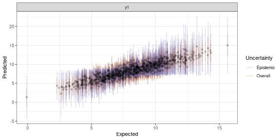

plot of chunk unnamed-chunk-29

### Estimates and uncertainty with the **Concrete Dropout** method

After the model is efficiently trained and the training quality has been
assessed, parameter estimates can be predicted with `abc$predict()`. I
predicted parameters for 1,000 simulated samples (summary statistics):

``` r

abc$predict()
#> [1] "Predictions with 1000 samples."
#> 
#> 
#> Performing conformal prediction
#> 
#> [1] "Predictions with 1000 samples."
```

You can get predictions with their associated uncertainties and
Conformal Credibility Intervals as a tidy data frame.

Credible Intervals are returned as explicit bounds
(`overall_conformal_lower`/`overall_conformal_upper`, and their
`epistemic_` counterparts) rather than as a half-width around the mean.
The bounds are computed in the scaled space in which the network was
trained and each endpoint is then transformed back individually. Since
every scaling method is monotone, this preserves the conformal coverage
guarantee exactly and keeps the bounds within the range of the
parameter. Under the non-linear `log` and `logit` scalings the intervals
are therefore asymmetric around `predictive_mean`, and must be used as
bounds rather than reconstructed from the mean.

``` r

head(abc$predictions())
#> Back-transform scaled parameters with method: none
#>   sample parameter predictive_mean epistemic_uncertainty aleatoric_uncertainty overall_uncertainty epistemic_conformal_lower
#> 1      1        y1       10.601369             0.4721973              1.096624            1.193966                  7.470954
#> 2      2        y1        7.766645             0.2547675              1.118807            1.147447                  6.077673
#> 3      3        y1        7.592340             0.2594116              1.095239            1.125541                  5.872580
#> 4      4        y1        7.376805             0.2631224              1.075434            1.107155                  5.632444
#> 5      5        y1        9.655092             0.4105554              1.099401            1.173558                  6.933329
#> 6      6        y1        4.925185             0.5379088              1.038986            1.169973                  1.359138
#>   epistemic_conformal_upper overall_conformal_lower overall_conformal_upper posterior_median posterior_lower_ci posterior_upper_ci
#> 1                 13.731784                8.549176               12.653562        10.694034           9.646818          11.211327
#> 2                  9.455616                5.794409                9.738881         7.794255           7.227952           8.200615
#> 3                  9.312099                5.657755                9.526924         7.616380           7.071207           8.037649
#> 4                  9.121165                5.473824                9.279786         7.384099           6.853655           7.826929
#> 5                 12.376854                7.637976               11.672208         9.732057           8.481791          10.226108
#> 6                  8.491231                2.914230                6.936139         4.856439           4.459275           6.475613
```

The trained model provides separate estimates of aleatoric and epistemic
uncertainty:

``` r

df_predicted = abc$predictions()
#> Back-transform scaled parameters with method: none

df_predicted$uncertainty_a_upper = df_predicted$predictive_mean + df_predicted$aleatoric_uncertainty
df_predicted$uncertainty_a_lower = df_predicted$predictive_mean - df_predicted$aleatoric_uncertainty

df_predicted$uncertainty_e_upper = df_predicted$predictive_mean + df_predicted$epistemic_uncertainty
df_predicted$uncertainty_e_lower = df_predicted$predictive_mean - df_predicted$epistemic_uncertainty

# The Conformal Credible Intervals are already returned as bounds on the
# original scale, so they are used directly rather than added to the mean
df_predicted$ci_conformal_upper = df_predicted$overall_conformal_upper
df_predicted$ci_conformal_lower = df_predicted$overall_conformal_lower

df_predicted$ci_conformal_e_upper = df_predicted$epistemic_conformal_upper
df_predicted$ci_conformal_e_lower = df_predicted$epistemic_conformal_lower

df_predicted$x = X_obs
df_predicted$y_true = Y_obs

df_training = data.frame(x = X_train,
                         y = Y_train)
```

``` r

ggplot(data = df_training[1:1000,], aes(x = x, y = y)) +
  geom_point(color = "blue", alpha = 0.3) +
  # geom_point(data = df_predicted, aes(x = x, y = y_true), color = "green", alpha = 0.3) +
  geom_line(data = df_predicted, aes(x = x, y = predictive_mean), color = "Red") +
  geom_point(data = df_predicted, aes(x = x, y = predictive_mean), color = "Red") +
  facet_wrap(~ parameter, scales = "free") +
  geom_ribbon(data = df_predicted, aes(x = x, y = predictive_mean, ymin = ci_conformal_e_upper, ymax = ci_conformal_e_lower), alpha = 0.4, fill = "purple") +
  geom_ribbon(data = df_predicted, aes(x = x, y = predictive_mean, ymin = ci_conformal_upper, ymax = ci_conformal_lower), alpha = 0.3, fill = "green") +
  theme_bw()
```


Predictions as a function of simulated parameter. The purple ribbon is
the Conformal Credible Interval based on the epistemic unvertainty
alone. The green ribbon is the Conformal Credible Interval based on the
overall unvertainty.

There are different Credible Intervals and uncertainty measures
provided. I recommend to use the overall Conformal Credible Interval in
practice, which is estimated with Conformal Prediction and using the
overall (aleatoric + epistemic) uncertainty as a proxy of the variance
(see Baragatti et al 2024 for details on the method). The overall
Conformal Credible Interval has a smoothing effect and fits really well
the expected C.I. in benchmarks (Brazier, unpublished). If the neural
network learned well from the data, both epistemic and overall Conformal
Credible Intervals should converged. Yet the epistemic Conformal
Credible Interval has an interesting property. It increases more than
the overall C.I. in regions where the data has not been seen by the
network during the training or where the predictive power is lower than
the rest of the dataset, yielding more conservative C.I. in these
regions, and giving a useful information for interpreting the model’s
outputs (see Figure above, especially compare the purple and green
C.I.). To validate the fit of the network, it is interesting to look
directly to the epistemic and aleatoric uncertainties estimated by
Concrete Dropout (see Figure below). Concrete Dropout and Deep Ensemble
jointly estimate the mean and the variance of each data point. The
uncertainty is the square root of the variance estimated (i.e., standard
deviation).

``` r

ggplot(data = df_training[1:1000,], aes(x = x, y = y)) +
  geom_point(color = "grey", alpha = 0.3) +
  # geom_point(data = df_predicted, aes(x = x, y = y_true), color = "green", alpha = 0.3) +
  geom_line(data = df_predicted, aes(x = x, y = predictive_mean), color = "Red") +
  geom_point(data = df_predicted, aes(x = x, y = predictive_mean), color = "Red") +
  facet_wrap(~ parameter, scales = "free") +
  geom_ribbon(data = df_predicted, aes(x = x, y = predictive_mean, ymin = uncertainty_a_lower, ymax = uncertainty_a_upper), alpha = 0.3, fill = "blue") +
  geom_ribbon(data = df_predicted, aes(x = x, y = predictive_mean, ymin = uncertainty_e_lower, ymax = uncertainty_e_upper), alpha = 0.3, fill = "red") +
  theme_bw()
```


Predictions as a function of simulated parameters. The epistemic
uncertainty (red) and aleatoric uncertainty (blue) were estimated with
Concrete Dropout (Gal et 2017).

The aleatoric uncertainty is constant across the dataset, as the
variance in the data is homogeneous (i.e. homoscedasticity), while the
epistemic uncertainty, reflecting model’s uncertainty, decreases at the
iddle of the distribution, where the model’s predictive performance is
better.

The raw uncertainty estimated with **Concrete Dropout**:

``` r

abc$plot_prediction(uncertainty_type = "uncertainty")
#> Back-transform scaled parameters with method: none
```


Prediction results with uncertainty quantification. Red line shows mean
predictions, blue ribbon indicates aleatoric uncertainty, and red ribbon
shows epistemic uncertainty.

The epistemic uncertainty increases at the edges of the distribution of
the training dataset.

The Conformal Credible intervals provide calibrated uncertainty
estimates with guaranteed coverage properties (Baragatti et al. 2024):

``` r

abc$plot_prediction(uncertainty_type = "conformal")
#> Back-transform scaled parameters with method: none
```


Conformal credible intervals (green) compared to epistemic uncertainty
intervals (purple). Conformal intervals provide calibrated coverage
guarantees.

The epistemic Conformal Credible Intervals, based on the epistemic
uncertainty as a proxy of uncertainty, are very sensitive to variance in
uncertainty, and increases shaprly at the edges of the data
distribution. It is a good choice if you are interested in very
conservative C.I. and want to assess the sensitivity to over-fitting.

On the contrary, the overall Conformal Credible Intervals, based on both
the aleatoric and epistemic uncertainties a proxy of the whole
uncertainty, is smoother and less impacted by local variance in
epistemic uncertainty. It is a good choice if you are searching for a
reliable and well-calibrated C.I.

Interestingly, the epistemic uncertainty increases in regions where the
cross-validation plot shows higher error rates (compare the plots above
and below):

``` r

abc$plot_cross_validation()
```

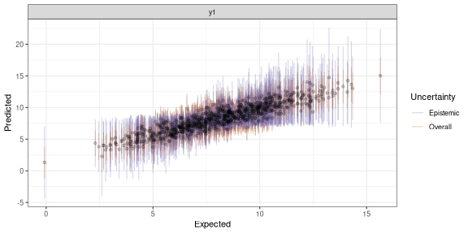

plot of chunk unnamed-chunk-35

If you have the same number of input and output parameters (e.g., x1 and
x2 as input, y1 and y2 as output), then the default representation in
`abc$plot_prediction()` will naturally represent linear regressions (as
many subplots as output parameters). Otherwise predictions are simply
represented side by side and the X axis is meaningless (the
`plot_type = "errorbar"` option offers a better representation).

``` r

abc$plot_prediction(uncertainty_type = "uncertainty", plot_type = "errorbar")
#> Back-transform scaled parameters with method: none
```

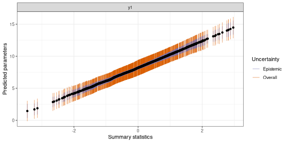

plot of chunk unnamed-chunk-36

### Plotting posteriors for individual observations

For specific observations, we can examine the approximate posterior
distribution:

``` r

abc$plot_posterior(sample = 701, prior = TRUE, uncertainty_type = "uncertainty") +
  geom_vline(xintercept = Y_obs[701], color = "red", size = 1.5)
#> Back-transform scaled parameters with method: none 
#> Back-transform scaled posteriors with method: none
```

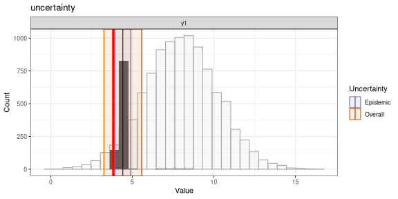

plot of chunk unnamed-chunk-37

``` r

Y_obs[701]
#> [1] 3.832962
abc$predictive_mean$y1[701]
#> [1] 4.420083
```

``` r

abc$plot_posterior(sample = 501, prior = TRUE, uncertainty_type = "conformal") +
  geom_vline(xintercept = Y_obs[501], color = "red", size = 1.5)
#> Back-transform scaled parameters with method: none 
#> Back-transform scaled posteriors with method: none
```


Distribution of approximate posterior estimates with predictive means
and credible intervals. The prior distribution is plotted underneath
(white bars) to compare priors and posteriors.

``` r

Y_obs[501]
#> [1] 10.05836
abc$predictive_mean$y1[501]
#> [1] 10.09593
```

## Case study 2: Nonlinear multivariate regression with **Deep Ensemble**

### A complex function combining sinus and cosinus functions

To demonstrate the capabilities of Deep Ensemble methods, we consider a
challenging nonlinear function with two output parameters:

``` math
\begin{align}
y_1 &= \sin(x_1) + \epsilon_1 \\
y_2 &= \cos(x_2) + \epsilon_2
\end{align}
```

where $`\epsilon_1, \epsilon_2`$ represent heteroscedastic noise with
varying magnitude across different regions of the input space.

### Data Generation with Missing Regions

We simulate two parameters and two summary statistics, with missing data
(gaps) and different amounts of random noise in the two parts of the
dataset:

``` r

set.seed(87)
# Parameters of simulated input x
data_range = 7
data_step = 0.0005

# Boundaries of the gap in the data range
bound1 = -2
bound2 = 2

# Random noise applied on y
data_sigma1a = 0.1
data_sigma2a = 0.5

data_sigma1b = 0.2
data_sigma2b = 0.1

# Number of simulated data points
# num_data = 10000

# Simulate x1
data_x1a = seq(-data_range, bound1 + data_step, by = data_step)
data_x1b = seq(bound2, data_range + data_step, by = data_step)
# Simulate targets y
data_y1a = sin(data_x1a) + rnorm(length(data_x1a), 0, data_sigma1a)
data_y1b = sin(data_x1b) + rnorm(length(data_x1b), 0, data_sigma2a)

# Shift X1 to get X2
data_x2a = data_x1a + 7
data_x2b = data_x1b + 7
# Simulate targets y
data_y2a = cos(data_x2a) + rnorm(length(data_x2a), 0, data_sigma1b)
data_y2b = cos(data_x2b) + rnorm(length(data_x2b), 0, data_sigma2b)

df = data.frame(x1 = c(data_x1a, data_x1b),
                    x2 = c(data_x2a, data_x2b),
                    y1 = c(data_y1a, data_y1b),
                    y2 = c(data_y2a, data_y2b))

# Shuffle data
shuffle_idx = sample(1:(nrow(df)), nrow(df), replace = FALSE)
df_train = df[shuffle_idx,]

# Train/Test datasets
# test_ratio = 0.1
# num_train_data = round(nrow(df) * (1 - test_ratio), digits = 0)
# num_test_data  = nrow(df) - num_train_data
# 
# train_x = df[1:num_train_data, c("x1", "x2")]
# train_y = df[1:num_train_data, c("y1", "y2")]
# test_x = df[num_train_data:nrow(df_train), c("x1", "x2")]
# test_y = df[num_train_data:nrow(df_train), c("y1", "y2")]
train_x = df_train[, c("x1", "x2")]
train_y = df_train[, c("y1", "y2")]


# Make a pseudo-obseerved dataset with out of distribution data points
# Simulate x1
data_x1 = seq(-data_range, data_range, length.out = 1000)
# Simulate true targets y
data_y1 = sin(data_x1)

# Shift X1 to get X2
data_x2 = data_x1 + 7
# Simulate targets y
data_y2 = cos(data_x2)

df_observed = data.frame(x1 = data_x1,
                x2 = data_x2,
                y1 = data_y1,
                y2 = data_y2)


observed_x  = df_observed[, c("x1", "x2")]
observed_y  = df_observed[, c("y1", "y2")]

df_deepensemble = list(df_train = df_train,
                       df_observed = df_observed)
```

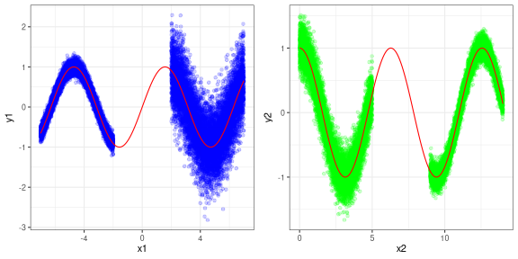

plot of chunk unnamed-chunk-40

### Deep Ensemble Training

Deep Ensemble trains multiple networks with different random
initialization and random batches (adversarial training not implemented
yet) (Lakshminarayanan et al. 2016):

``` r

# devtools::load_all()
# Predict Y when X is observed
theta = train_y
sumstats = train_x
observed = observed_x
true_param = observed_y

abc_ensemble = abcnn$new(theta,
            sumstats,
            observed,
            method = 'deep ensemble',
            num_networks = 5,
            scale_input = "minmax",
            scale_target = "none",
            epochs = 20,
            num_hidden_layers = 3,
            num_hidden_dim = 512,
            batch_size = 128,
            seed = 4722)
```

``` r

abc_ensemble$fit()
#> ===================================================
#> ABC Neural Net. Bayesian Deep learning and ABC.
#> ===================================================
#> ABC parameter inference with the method: deep ensemble 
#> 
#> 
#> |Sample      |  Size| Proportion|
#> |:-----------|-----:|----------:|
#> |Simulations | 20004|         NA|
#> |Training    | 15004|         NA|
#> |Testing     |  2000|        0.1|
#> |Evaluation  |  2000|        0.1|
#> |Conformal   |  1000|         NA|
#> |Observed    |  1000|         NA|
#> 
#> Is CUDA available? [1] FALSE
#> 
#> Device is: torch_device(type='cpu') 
#> 
#> Call: initialize(theta = ..1, sumstat = ..2, observed = ..3, method = "deep ensemble", 
#>     scale_input = "minmax", scale_target = "none", num_hidden_layers = 3, 
#>     num_hidden_dim = 512, batch_size = 128, epochs = 20, num_networks = 5, 
#>     seed = 4722)
```

Checking the model training:

``` r

abc_ensemble$plot_training()
```

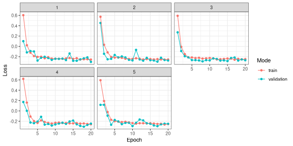

plot of chunk unnamed-chunk-43

### Variation in Uncertainty Quantification across different regions

Predict on new data. Predictions are almost instantaneous with Deep
Ensemble, as only one forward pass is necessary contrary to Dropout
methods.

``` r

abc_ensemble$predict()
#> [1] "Predictions with 1000 samples."
#> 
#> 
#> Performing conformal prediction
#> 
#> [1] "Predictions with 1000 samples."
```

Save the result:

``` r

save_abcnn(abc_ensemble, prefix = "../inst/extdata/abc_ensemble")
```

Deep Ensembles provide particularly insightful uncertainty estimates
across different data regions:

``` r

abc_ensemble$plot_prediction(uncertainty_type = "uncertainty")
#> Back-transform scaled parameters with method: none
```

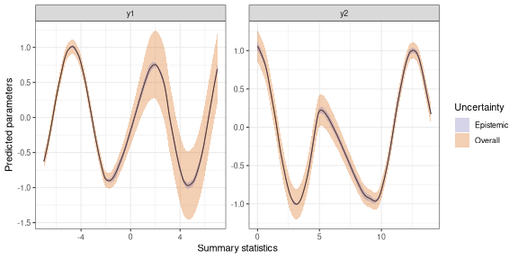

plot of chunk unnamed-chunk-46

``` r

abc_ensemble$plot_prediction(uncertainty_type = "conformal")
#> Back-transform scaled parameters with method: none
```

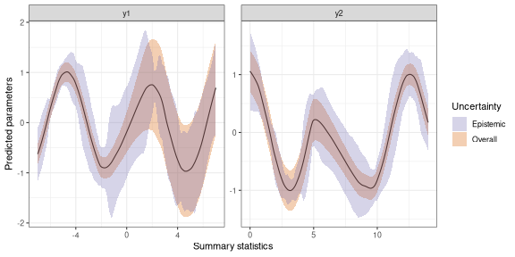

plot of chunk unnamed-chunk-47

The uncertainty, especially epistemic uncertainty, increases in unseen
regions during training. In addition, the aleatoric uncertainty
increases in regions with higher variance (i.e. noise) in data. In the
sace of a sample within the training distribution where there is not a
lot of noise in the data, both epistemic and overall conformal
prediction intervals converge and are narrow around the prediction:

``` r

# Print a sample with -5 < x1 < -4 (within the distribution with a low noise)
# which(abc$observed < -4 & abc$observed > -5)
abc_ensemble$plot_posterior(sample = 155, prior = TRUE)
#> Back-transform scaled parameters with method: none
```

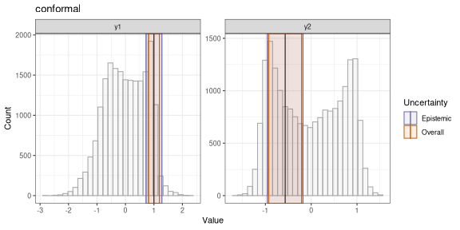

plot of chunk unnamed-chunk-48

For samples in a region with a lot of noise in the data, both the
overall and epistemic conformal prediction intervals increase:

``` r

# Print a sample with 4 < x1 < 5 (within the distribution with a high noise)
# which(abc$observed < 5 & abc$observed > 4)
abc_ensemble$plot_posterior(sample = 800, prior = TRUE)
#> Back-transform scaled parameters with method: none
```

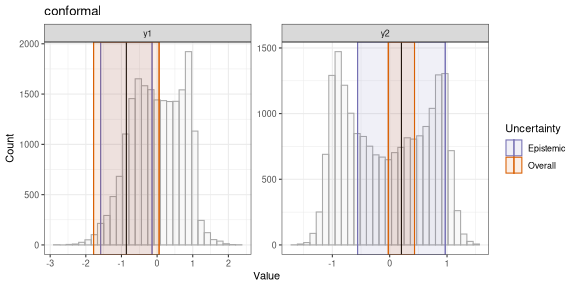

plot of chunk unnamed-chunk-49

When predicting out of the training distribution, the epistemic
conformal prediction interval increases a lot compared to the overall:

``` r

# Print a sample with -1 < x1 < 1 (out of training distribution)
# which(abc$observed < 1 & abc$observed > -1)
abc_ensemble$plot_posterior(sample = 520, prior = TRUE)
#> Back-transform scaled parameters with method: none
```

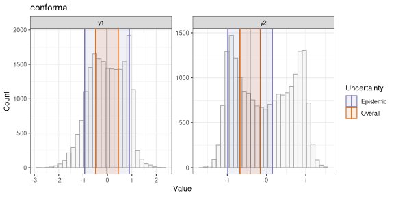

plot of chunk unnamed-chunk-50

## Case Study 3: Model Interpretability and Feature Importance in a high-dimensional dataset

### Gaussian Toy Model

We demonstrate this approach on a homoscedastic normal model, where
$`\text{Inv-Gamma}(\alpha, \beta)`$ denotes an inverse Gamma
distribution with shape parameter $`\alpha`$ and scale parameter
$`\beta`$:

``` math
y \sim \mathcal{N}(\mu, \sigma^2), \quad \mu \sim \mathcal{N}(0, \sigma^2), \quad \sigma^2 \sim \text{Inv-Gamma}(\alpha, \beta)
```

It is straightforward to derive the exact values of $`E(θ1 | y)`$,
$`Var(θ1 | y)`$, $`E(θ2 | y)`$, $`Var(θ2 | y)`$ and posterior quantiles
for the two parameters from the above expressions and for a given sample
y (see (Raynal et al. 2019) for details on the method).

In addition we add 50 noisy random summary statistics simulated
according to a uniform(0,1) distribution to see how the model can handle
noise in high dimensional dataset. Hence there are a total of 61 summary
statistics, and only 11 of these are informative.

``` r

# For training
sumstats.train = as.data.frame(dataset$x.train)
theta.train = as.data.frame(dataset$y.train)

# Testing
sumstats.test = dataset$x.test
theta.test = dataset$y.test

# The exact value to find
theta.exact = dataset$y.exact
```

### Training a Deep Ensemble model

``` r

deepensemble_highdim = abcnn$new(theta.train,
            sumstats.train,
            sumstats.test[1:1000,],
            method = 'deep ensemble',
            scale_input = "minmax",
            scale_target = "minmax",
            num_hidden_layers = 3,
            num_hidden_dim = 256,
            epochs = 20,
            batch_size = 64,
            l2_weight_decay = 1e-4,
            seed = 42)


deepensemble_highdim$summary()
#> ===================================================
#> ABC Neural Net. Bayesian Deep learning and ABC.
#> ===================================================
#> ABC parameter inference with the method: deep ensemble 
#> 
#> 
#> |Sample      |  Size| Proportion|
#> |:-----------|-----:|----------:|
#> |Simulations | 20000|         NA|
#> |Training    | 15000|         NA|
#> |Testing     |  2000|        0.1|
#> |Evaluation  |  2000|        0.1|
#> |Conformal   |  1000|         NA|
#> |Observed    |  1000|         NA|
#> 
#> Is CUDA available? [1] FALSE
#> 
#> Device is: torch_device(type='cpu') 
#> 
#> Call: initialize(theta = ..1, sumstat = ..2, observed = ..3, method = "deep ensemble", 
#>     scale_input = "minmax", scale_target = "minmax", num_hidden_layers = 3, 
#>     num_hidden_dim = 256, batch_size = 64, epochs = 20, l2_weight_decay = 1e-04, 
#>     seed = 42)
```

| Hyperparameter | Value |
|:---|:---|
| Method | deep ensemble |
| Scaling for inputs (summary statistics) | minmax |
| Scaling for targets (theta) | minmax |
| Number hidden layers | 3 |
| Number hidden dimensions | 256 |
| Batch size | 64 |
| Epochs | 20 |
| Early stopping callback | FALSE |
| Patience for early stopping | 4 |
| Learning rate | 0.001 |
| L2 weight decay | 1e-04 |
| Method for ABC | loclinear |
| Tolerance rate (ABC) | 0.1 |
| Number of posterior samples (mc dropout and concrete dropout) | 1000 |
| Dropout rate | 0.5 |
| Number of networks (deep ensemble) | 5 |

``` r

deepensemble_highdim$fit()
#> ===================================================
#> ABC Neural Net. Bayesian Deep learning and ABC.
#> ===================================================
#> ABC parameter inference with the method: deep ensemble 
#> 
#> 
#> |Sample      |  Size| Proportion|
#> |:-----------|-----:|----------:|
#> |Simulations | 20000|         NA|
#> |Training    | 15000|         NA|
#> |Testing     |  2000|        0.1|
#> |Evaluation  |  2000|        0.1|
#> |Conformal   |  1000|         NA|
#> |Observed    |  1000|         NA|
#> 
#> Is CUDA available? [1] FALSE
#> 
#> Device is: torch_device(type='cpu') 
#> 
#> Call: initialize(theta = ..1, sumstat = ..2, observed = ..3, method = "deep ensemble", 
#>     scale_input = "minmax", scale_target = "minmax", num_hidden_layers = 3, 
#>     num_hidden_dim = 256, batch_size = 64, epochs = 20, l2_weight_decay = 1e-04, 
#>     seed = 42)
```

``` r

deepensemble_highdim$plot_training()
```

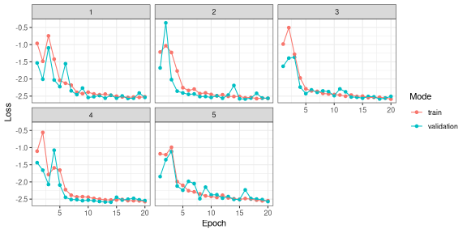

plot of chunk unnamed-chunk-55

### Model performance

Evaluate performance with cross-validation (here we re-use the previous
observed test set for convenience):

``` r

true.theta = data.frame(theta1 = theta.exact$mean.theta1,
                        theta2 = theta.exact$mean.theta2)

deepensemble_highdim$cross_validation(true.theta,
                                      sumstats.test)
#> [1] "Predictions with 1000 samples."
#> 
#> 
#> Performing conformal prediction
#> 
#> [1] "Predictions with 1000 samples."
#> Back-transform scaled parameters with method: minmax
#> # A tibble: 2 × 10
#>   parameter     n    mae     mse   rmse  nmae   cor   cov mean_epistemic_interval mean_overall_interval
#>   <chr>     <int>  <dbl>   <dbl>  <dbl> <dbl> <dbl> <dbl>                   <dbl>                 <dbl>
#> 1 theta1     1000 0.0398 0.00270 0.0519 0.465 0.999 0.933                    1.33                  1.20
#> 2 theta2     1000 0.0602 0.00770 0.0877 0.502 0.976 0.355                    1.72                  1.28

deepensemble_highdim$plot_cross_validation()
```

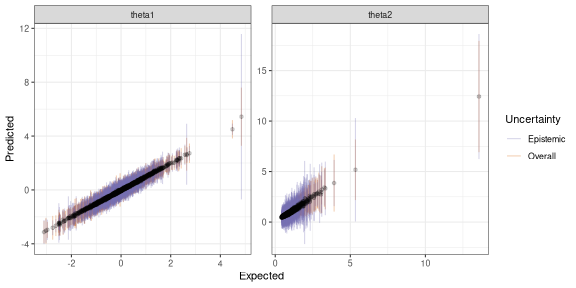

plot of chunk unnamed-chunk-56

Plot the predictions on the observed summary statistics:

``` r

deepensemble_highdim$predict()
#> [1] "Predictions with 1000 samples."
#> 
#> 
#> Performing conformal prediction
#> 
#> [1] "Predictions with 1000 samples."

deepensemble_highdim$plot_prediction(uncertainty_type = "conformal")
#> Back-transform scaled parameters with method: minmax
```


TabNet-ABC performance showing posterior quantile predictions compared
to true parameter values.

``` r

df = deepensemble_highdim$predictions() %>%
  filter(parameter == "theta1")
#> Back-transform scaled parameters with method: minmax

df$true.theta = theta.exact[1:1000,"mean.theta1"]

ggplot(df, aes(x = true.theta, y = predictive_mean)) +
  geom_ribbon(aes(ymin = overall_conformal_lower,
                  ymax = overall_conformal_upper),
              fill = "lightgrey", alpha = 0.5) +
  geom_point(alpha = 0.6) +
  geom_smooth(method = "lm", se = FALSE, color = "red") +
  labs(x = "True Posterior Mean", y = "Predicted Mean",
       title = "Deep Ensemble Predictive check Theta 1") +
  theme_bw()
```


Scatter plot comparing DeepEnsemble predictions to exact posterior
means. The shaded region represents 95% credible intervals.

``` r

df = deepensemble_highdim$predictions() %>%
  filter(parameter == "theta2")
#> Back-transform scaled parameters with method: minmax

df$true.theta = theta.exact[1:1000,"mean.theta2"]

ggplot(df, aes(x = true.theta, y = predictive_mean)) +
  geom_ribbon(aes(ymin = overall_conformal_lower,
                  ymax = overall_conformal_upper),
              fill = "lightgrey", alpha = 0.5) +
  geom_point(alpha = 0.6) +
  geom_smooth(method = "lm", se = FALSE, color = "red") +
  labs(x = "True Posterior Mean", y = "Predicted Mean",
       title = "Deep Ensemble Predictive check Theta 2") +
  theme_bw()
```


Scatter plot comparing DeepEnsemble predictions to exact posterior
means. The shaded region represents 95% credible intervals.

``` r

deepensemble_highdim$plot_posterior(100)
#> Back-transform scaled parameters with method: minmax
```

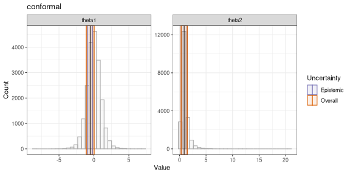

Prediction for a single point.

### Model Interpretability and Feature Importance

Understanding which summary statistics drive parameter estimates is
crucial for scientific interpretation. The **explainn** class implements
a suite of methods to provide interpretable feature attributions.

### The `explainn()` class and methods for model explanation

The
[https://bips-hb.github.io/innsight/](https://thomasbrazier.github.io/abcneuralnet/articles/**innsight**)
package backend provides twelve different explainability methods to
interpret feature importance within an **explainn** object. Both local
and global methods are provided, to interpret feature importance for a
focal prediction (a single output/sample) or summarize importances
across a whole dataset (multiple samples).

DeepLift (deep learning important features) is an algorithm introduced
by Shrikumar et al. (2017). It’s a local method for interpreting a
single element output prediction $`x`$, given a reference $`x'`$,
returning the contribution of each input feature from the difference of
the output $`y = f(x)`$ and the reference output $`y' = f(x')`$
prediction.

``` r

exp = explainn$new(deepensemble_highdim)

exp$run(data = sumstats.test[1:1000,],
        method = "deeplift")
```

``` r

exp$plot()
```


Feature importance visualization using DeepLIFT attribution methods, for
the first sample output prediction. Colors indicate the contribution of
each feature to the final prediction.

Even if DeepLift is a local method, multiple samples can be passed and
importance scores summarizzed across all samples’ predictions.

``` r

exp$plot_global()
```


Feature importance visualization using DeepLIFT attribution methods,
summarized across the 1,000 smaples. Colors indicate the contribution of
each feature to the final prediction.

The individual contributions of input variables to the subject
prediction:

``` r

# Three dimension outpout:
# - First sample
# - 10 first summary statistics
# - the two output parameters
exp$get_result()[1,1:10,1:2]
#>                    theta1        theta2
#> expectation  0.1618334949 -0.0325705484
#> variance    -0.0066348240  0.0050269491
#> mad         -0.0099019427  0.0008929950
#> x1          -0.0010731217  0.0004772787
#> x2           0.0013431844 -0.0002233239
#> x3          -0.0008478618  0.0002514657
#> x4           0.0015044919  0.0026225583
#> x5           0.0001447744  0.0002012830
#> x6           0.0007850530  0.0017604291
#> x7          -0.0017573310 -0.0031582920
```

SmoothGrad is another method, which can also be interpreted as local and
global feature importance scores. SmoothGrad was introduced by D.
Smilkov et al. (2017) and is an extension to the classical Vanilla
Gradient method (see
[SmoothGrad](https://bips-hb.github.io/innsight/reference/SmoothGrad.html)
for more details).

``` r

exp = explainn$new(deepensemble_highdim)

exp$run(data = sumstats.test[1:1000,],
        method = "smoothgrad")
```

``` r

exp$plot()
```


Feature importance visualization using SmoothGrad attribution methods.
Colors indicate the contribution of each feature to the final
prediction.

``` r

exp$plot_global()
```


Feature importance visualization using SmoothGrad attribution methods.
Colors indicate the contribution of each feature to the final
prediction.

The individual contributions of input variables to individual
predictions:

``` r

exp$get_result()[1:5,1:10,1]
#>      expectation   variance         mad            x1            x2            x3            x4            x5            x6            x7
#> [1,]   0.2683790 -0.2351933 -0.09878340  0.0016331869  1.343698e-03 -0.0010380116  0.0006672929 -0.0011226608  0.0018467242  3.367677e-05
#> [2,]   0.2663781 -0.2046865 -0.09719737  0.0025592453  9.592294e-05 -0.0036371159  0.0005804934 -0.0076131197  0.0006643549 -4.347973e-06
#> [3,]   0.2616821 -0.2365807 -0.09422367 -0.0009636884 -3.454776e-03 -0.0032377103 -0.0021944055  0.0042960383  0.0041048457  2.431569e-03
#> [4,]   0.2509564 -0.2622837 -0.08266627 -0.0024184417 -7.665483e-03  0.0007829172  0.0026333525 -0.0026536314  0.0015529236 -3.180863e-04
#> [5,]   0.2555846 -0.2226619 -0.09164830 -0.0007706676 -5.534437e-03 -0.0036885550  0.0017851513 -0.0003452587 -0.0023921498 -1.237880e-03
```

## ABC Integration with TabNet

### TabNet Architecture for Summary Statistics

TabNet-ABC (Arik and Pfister 2020; Åkesson et al. 2022) combines
interpretable attention mechanisms with traditional ABC methods. The key
innovation is using TabNet to learn informative summary statistics from
raw simulation outputs, then applying standard ABC regression on these
learned features.

### TabNet-ABC Implementation

Tabnet is trained to predict the mean parameter, which is re-used during
inference as a new informative summary statistics. We leverage the
Tabnet Attention map and feature importance to subset only the most
informative summary statistics for the ABC inference step. They are then
concatenated to the Tabnet predicted mean.

``` r

tabnetabc = abcnn$new(theta.train[1:10000,],
            sumstats.train[1:10000,],
            sumstats.test[1:1000,],
            method = 'tabnet-abc',
            scale_input = "none",
            scale_target = "none",
            epochs = 30,
            batch_size = 64,
            tol = 0.1,
            abc_keep_original_sumstats = 10,
            abc_method = "loclinear",
            seed = 4567)


tabnetabc$summary()
#> ===================================================
#> ABC Neural Net. Bayesian Deep learning and ABC.
#> ===================================================
#> ABC parameter inference with the method: tabnet-abc 
#> 
#> 
#> |Sample      |  Size| Proportion|
#> |:-----------|-----:|----------:|
#> |Simulations | 10000|         NA|
#> |Training    |  7000|         NA|
#> |Testing     |  1000|        0.1|
#> |Evaluation  |  1000|        0.1|
#> |Conformal   |  1000|         NA|
#> |Observed    |  1000|         NA|
#> 
#> Is CUDA available? [1] FALSE
#> 
#> Device is: torch_device(type='cpu') 
#> 
#> Call: initialize(theta = ..1, sumstat = ..2, observed = ..3, method = "tabnet-abc", 
#>     scale_input = "none", scale_target = "none", batch_size = 64, 
#>     epochs = 30, abc_method = "loclinear", tol = 0.1, abc_keep_original_sumstats = 10, 
#>     seed = 4567)
```

| Hyperparameter                                                | Value      |
|:--------------------------------------------------------------|:-----------|
| Method                                                        | tabnet-abc |
| Scaling for inputs (summary statistics)                       | none       |
| Scaling for targets (theta)                                   | none       |
| Number hidden layers                                          | 3          |
| Number hidden dimensions                                      | 128        |
| Batch size                                                    | 64         |
| Epochs                                                        | 30         |
| Early stopping callback                                       | FALSE      |
| Patience for early stopping                                   | 4          |
| Learning rate                                                 | 0.001      |
| L2 weight decay                                               | 1e-05      |
| Method for ABC                                                | loclinear  |
| Tolerance rate (ABC)                                          | 0.1        |
| Number of posterior samples (mc dropout and concrete dropout) | 1000       |
| Dropout rate                                                  | 0.5        |
| Number of networks (deep ensemble)                            | 5          |

``` r

tabnetabc$fit()
#> ===================================================
#> ABC Neural Net. Bayesian Deep learning and ABC.
#> ===================================================
#> ABC parameter inference with the method: tabnet-abc 
#> 
#> 
#> |Sample      |  Size| Proportion|
#> |:-----------|-----:|----------:|
#> |Simulations | 10000|         NA|
#> |Training    |  7000|         NA|
#> |Testing     |  1000|        0.1|
#> |Evaluation  |  1000|        0.1|
#> |Conformal   |  1000|         NA|
#> |Observed    |  1000|         NA|
#> 
#> Is CUDA available? [1] FALSE
#> 
#> Device is: torch_device(type='cpu') 
#> 
#> Call: initialize(theta = ..1, sumstat = ..2, observed = ..3, method = "tabnet-abc", 
#>     scale_input = "none", scale_target = "none", batch_size = 64, 
#>     epochs = 30, abc_method = "loclinear", tol = 0.1, abc_keep_original_sumstats = 10, 
#>     seed = 4567)
```

``` r

tabnetabc$plot_training()
```

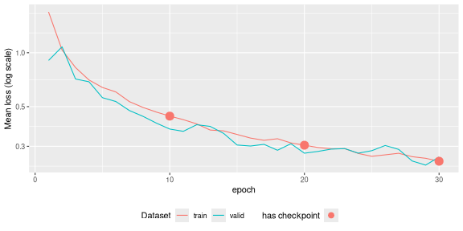

plot of chunk unnamed-chunk-70

### Model performance

``` r

tabnetabc$plot_prediction(uncertainty_type = "posterior quantile",
                          plot_type = "errorbar")
#> Back-transform scaled parameters with method: none
```


TabNet-ABC performance showing posterior quantile predictions compared
to true parameter values.

``` r

df = tabnetabc$predictions() %>%
  filter(parameter == "theta1")
#> Back-transform scaled parameters with method: none

df$true.theta = theta.exact[1:1000,"mean.theta1"]

ggplot(df, aes(x = true.theta, y = predictive_mean)) +
  geom_ribbon(aes(ymin = posterior_lower_ci, ymax = posterior_upper_ci), 
              fill = "lightgrey", alpha = 0.5) +
  geom_point(alpha = 0.6) +
  geom_smooth(method = "lm", se = FALSE, color = "red") +
  labs(x = "True Posterior Mean", y = "Predicted Mean",
       title = "TabNet-ABC Predictive check") +
  theme_bw()
```


Scatter plot comparing TabNet-ABC predictions to exact posterior means.
The shaded region represents 95% credible intervals.

``` r

tabnetabc$plot_posterior(5, uncertainty_type = "posterior quantile")
#> Back-transform scaled parameters with method: none
#> Error in `self$posterior_samples[, sample, ]`:
#> ! nombre de dimensions incorrect
```

### Tabnet attention maps for model explanation

With the method **Tabnet-ABC**, built-in attention maps and **tabnet**
methods are used instead of **innsight** methods:

``` r

exp = explainn$new(tabnetabc)
#> [1] "Note that Tabnet-ABC has its own set of explainability methods."

exp$run(data = sumstats.test)
```

``` r

exp$plot()
```

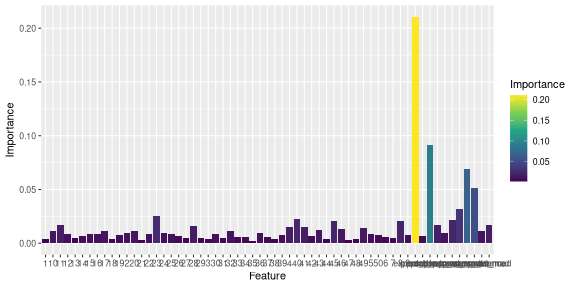

plot of chunk unnamed-chunk-74

``` r

exp$plot(type = "mask_agg")
```

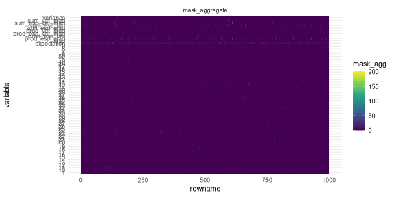

plot of chunk unnamed-chunk-75

``` r

exp$plot(type = "steps")
```

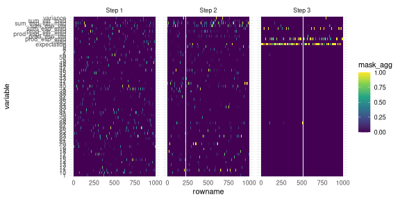

plot of chunk unnamed-chunk-76

## FAQ

*1. How does it work?*

**abcneuralnet** proposes a simple straightforward workflow:

1.  Training. Define your data and model architecture with
    `abcnn$new()`. Call `abcnn$fit()` on your model. All is very
    user-friendly, `torch` and `luz` handle batching, backpropagation,
    and optimization automatically, as well as handling the device (cpu
    or CUDA gpu).

2.  Validation. During training, `luz` evaluates and print the
    performance of the model on a separate validation dataset to monitor
    overfitting and generalization at each epoch. After training, check
    training and validation loss curves with `abcnn$plot_training()` to
    evaluate under/overfitting.

3.  Testing. After training, evaluate the trained model on an unseen
    test set (a subset of the training data). The multi-output
    predictions of **abcneuralnet** allow you to evaluate the predictive
    performance by predicting on a test set (a simulated dataset with
    known ground truth). Use `abcnn$predict()` method to get predictions
    on both the test set and calculate custom metrics on the test set.

4.  Posterior predictive check is an additional important step to
    evaluate the model’s performance in a Bayesian framework. It is
    similar to step 3, but instead of testing on a subset of the
    training data, you must re-generate a simulated dataset where the
    priors are the posterior estimated by the model. Call
    `abcnn$predict(posterior_check_data)` where `posterior_check_data`
    is your new simulated summary statistics generated by drawing
    parameters in the posterior. As in step 3, calculate custom metrics
    on the posterior predictive test set to evaluate the model’s
    predictive performance.

5.  Iteratively improve the model. Adjust hyperparameters or model
    architecture based on diagnostics, and re-train.

6.  Infer parameters based on observed summary statistics. Call
    `abcnn$predict(observed_data)` where `observed_data` is your
    observed summary statistics.

At first, I advise to train a smaller/simpler model (around 3-5 hidden
layers and between 100 and 500 neurons per layer max), on a reduced
dataset (10,000 - 100,000 samples), to check first how it behaves with
your dataset. A small training set will allow you to rapidly explore the
hyperparameter space. Then, once you have found a model learning well,
you can increase the training dataset and adjust accordingly the
hyperparameters to scale up (usually `batch size` and `learning rates`
have to be adjusted to account for overfitting when the sample size
increases, see Table 1 for details on hyperparameters).

Most importantly, feel free to contact me for any questions and comments
on your usage of the package (and raise **github issues**). I will do my
best to document any troubleshooting encountered and to address bugs as
fast as possible. Note that this package is under continuous development
and improvements.

If you are not familar with Neural Networks, I recommend the book
**Hands-on machine learning with Scikit-Learn, Keras, and TensorFlow**
from Aurélien Géron, or this free online book
[https://skeydan.github.io/Deep-Learning-and-Scientific-Computing-with-R-torch/](https://thomasbrazier.github.io/abcneuralnet/articles/Deep%20Learning%20and%20Scientific%20Computing%20with%20R%20torch)
as a good introduction to the Torch ecosystem in R. See also the
documentation at
[https://torch.mlverse.org/](https://thomasbrazier.github.io/abcneuralnet/articles/torch%20for%20R).

*2. Which method should I choose?*

Bayesian neural networks possess several specific characteristics that
must be considered, as detailed below. For the Concrete Dropout and Deep
Ensemble methods, model training can be more challenging than with
conventional neural networks, since the model jointly estimates both the
mean prediction and its associated variance. However, this variance
component is also what makes these two methods particularly valuable in
a Bayesian context. They allow the joint estimation of the model’s
epistemic uncertainty (uncertainty in the model itself) and the
aleatoric uncertainty (uncertainty inherent in the data), effectively
enabling the model to “know when it doesn’t know”. These capabilities
are powerful features for assessing model performance and overall
reliability, and they arguably justify the slightly lower predictive
performance often observed compared to standard neural networks.

This behavior also implies that if your training dataset (simulations)
lacks informativeness or if the model architecture is poorly suited to
the observed data, the neural network will explicitly indicate its
inability to learn with a large epistemic uncertainty. In such cases,
training will fail, typically evidenced by a loss function that
decreases only weakly over epochs or exhibits large stochastic
fluctuations between epochs—underscoring the importance of closely
monitoring training curves. Even when training appears successful, a
misspecified model or uninformative simulations will generally lead to
extremely high uncertainty estimates and wide credible intervals.

In contrast, the Monte Carlo Dropout and TabNet-ABC methods do not
exhibit this “variance” issue and tend to behave similarly to
conventional neural networks. The Monte Carlo Dropout approach is
simple, not especially high-performing, and offers limited
interpretability — estimating only epistemic uncertainty — but it
remains useful for quickly testing hypotheses thanks to its ease of
training. The TabNet-ABC method follows a similar principle to that
described in Åkesson et al. (2022), with the key distinction that the
CNN is replaced by a Transformer neural network, which performs better
on tabular data. In this framework, a neural network estimates the mean
posterior of the parameters, which are then used as summary statistics
for a standard ABC procedure. Thus, the Bayesian component is
implemented through the ABC algorithm (e.g., using the abc package),
rather than being integrated into the neural network itself.

The TabNet architecture is highly effective for processing tabular data
— such as the reference table in ABC — and includes a built-in attention
mechanism that provides feature importance scores. Consequently,
TabNet-ABC is an excellent alternative if Concrete Dropout and Deep
Ensemble prove difficult to apply, or if one seeks to remain closely
aligned with a more traditional ABC framework.

Choosing the appropriate method depends on several factors:

| Method | Strengths | Limitations | Computational Cost |
|----|----|----|----|
| Concrete Dropout | Principled uncertainty, Bayesian framework, Almost as efficient as Deep Ensemble for predictive performance and Credible Interval | Training complexity, heteroscedastic loss, Sensitive to statistical outliers and large variance in the training dataset (scaling the data is recommended), Epistemic uncertainty estimates can be noisy/too large when overfitting (prefer the overall uncertainty) | Medium |
| Monte Carlo Dropout | Simple implementation, fast inference | Limited uncertainty quantification (only epistemic), Less efficient than other methods, Larger credible intervals, Requires fine-tuning the dropout rate | Low |
| Deep Ensemble | Robust, adversarial training, The most efficient in predictive performance and Credible Interval, Smoother uncertainty estimates | High memory usage and training time increases with the number of networks, but inference is very fast, does not generate a full posterior (only point estimates of mean and variance) | Medium |
| TabNet-ABC | Interpretability, ABC integration, The Transformer architecture is designed to handle tabular data, built-in Attention map | Two-stage process, Requires an additional ABC procedure to estimate the full posterior, Only epistemic uncertainty | High |

*3. Should I transform the input data?*

Pre-processing and scaling the input data is crucial to achieve good
performances with neural networks. It is even more true with Bayesian
neural networks (BNN), as large differences in scales within or between
variables can have more dramatic effects on the variance than the mean.
If your model is not learning well or have an unexpected behavior, I
advise you to think about the nature of your data and try to find an
appropriate scaling function. Scaling the data is very easy, as scaling
both the input and target data is directly implemented in the package,
through the `scale_input` and `scale_target` arguments. You can choose
the `minmax`, `robustscaler` or `normalization` scaling methods, or just
`none` if you don’t want scaling. Usually `minmax` and `robustscaler`
perform well. For the scaling, the scale function learns its parameters
on the training set only to avoid data leakage. If you choose to scale
the target too (for example if your target is a mix of rates and
continuous values), the predictions are transformed back to the original
scale.

*4. How do I evaluate the training performance of my model?*

To evaluate the training of your model (how well it learned), the best
approach is simply to look at the learning curves. I will not detail how
to interpret these curves, there is a lot of literature about it and it
is the same for every neural network. See for example [this
post](https://rstudio-conf-2020.github.io/dl-keras-tf/notebooks/learning-curve-diagnostics.nb.html).
The package offers all the necessary information to evaluate the
learning curve, with losses estimated on three independent training,
validation and evaluation sets.

*5. Which type of uncertainty must I consider?*

Once your model has passed the learning-curve diagnostic, you can move
on to deeper validation by examining and comparing the epistemic and
aleatoric uncertainties. These raw uncertainty components provide
particularly useful insight into model behavior across samples, allowing
you to identify regions where predictions are accurate and confident
(low epistemic uncertainty) and regions where the model effectively
“does not know”, making predictions unreliable. In general, epistemic
uncertainty is high in areas with few data points or outside the
training distribution. This analysis also helps determine whether
performance is mainly limited by the model (epistemic) or by the data
(aleatoric), noting that epistemic uncertainty can often be reduced with
more or better data, whereas aleatoric uncertainty reflects irreducible
noise in the data. Typically, epistemic uncertainty should be noticeably
lower than aleatoric uncertainty; if epistemic uncertainty is similar to
or higher than aleatoric uncertainty, it indicates that the model has
not learned the data-generating structure effectively.

For publications or reporting, conformal credible intervals are
generally more appropriate than raw uncertainty values, because they are
calibrated to achieve a specified coverage level (by default, a 95%
interval). The interpretation of the Conformal Credible Intervals is
similar to that of Bayesian credible intervals, while additionally
offering formal coverage guarantees under suitable assumptions.

*7. How do I tune the hyperparameters of the model?*

Stick to simple, widely-used standard values. Train simpler models for
test purpose, before running larger models in production. Beware than
larger models can sometimes require adjustments for the learning
hyperparameters when scaling up (learning rate, batch size), as larger
sample sizes also have effects on overfitting and on the variance that
is estimated by the model. A larger sample size affects the epistemic
uncertainty, the uncertainty of the model, while the aleatoric
uncertainty, the uncertainty of the data itself, should not be much
affected.

The number of hidden layers and hidden dimensions (number of neurons)
are important to efficiently capture complex non-linear relationships
between input and output features, but with Bayesian Neural Network it
is not necessary to use a large number of neurons and layers. Generally
3-6 layers with 100-500 neurons each is sufficient. Yet the most
critical hyperparameters are those related to the training procedure,
such as the learning rate and the batch size. The L2 weight decay only
has a minimum impact, and the default value should be fine, except if
you observe a strong overfitting.

| Hyperparameter | Values |
|:---|:---|
| Number of hidden dimensions (i.e. neurons) in one layer | 100-500 is generally a good range. You can try higher values if you have more than 200 summary statistics. |
| Number of hidden layers | 3-6, deeper networks tend to be harder to train |
| Epochs | 30-60 are generally enough to avoid overfitting |
| Batch size | 32-256, depending mostly on the variance in your training set. Higher batch sizes have a smoothing effect on excess of variance during training. |
| Learning rate | 1e-3 is generally fine for 10,000-100,000 training samples. 1e-4 tend to be better for sample sizes \>= 1,000,000. |
| L2 weight decay | 1e-5, minimal impact. |
| Dropout (only for Monte Carlo Dropout) | 0.1-0.5. Smaller values should produce smaller Credible Intervals, but at the risk of less precise or biased estimates. Higher values are more conservative. |

Hyperparameters available in abcnn and standard range of values.
{.table}

## References

Åkesson, Mattias, Prashant Singh, Fredrik Wrede, and Andreas Hellander.
2022. “Convolutional Neural Networks as Summary Statistics for
Approximate Bayesian Computation.” *IEEE/ACM Transactions on
Computational Biology and Bioinformatics* 19 (6): 3353–65.
<https://doi.org/10.1109/TCBB.2021.3108695>.

Arik, Sercan O., and Tomas Pfister. 2020. *TabNet: Attentive
Interpretable Tabular Learning*. December.
<https://doi.org/10.48550/arXiv.1908.07442>.

Baragatti, Meili, Bertrand Cloez, David Métivier, and Isabelle Sanchez.
2024. *Approximate Bayesian Computation with Deep Learning and Conformal
Prediction*. arXiv. <http://arxiv.org/abs/2406.04874>.

Beaumont, Mark A. 2019. *Approximate Bayesian Computation*.

Blum, Michael G. B. 2010. “Approximate Bayesian Computation: A
Nonparametric Perspective.” *Journal of the American Statistical
Association* 105 (491): 1178–87.
<https://doi.org/10.1198/jasa.2010.tm09448>.

Falbel, Daniel, and Javier Luraschi. 2025. *Torch: Tensors and Neural
Networks with ’GPU’ Acceleration*. <https://torch.mlverse.org/docs>.

Gal, Yarin, and Zoubin Ghahramani. 2016. “Dropout as a Bayesian
Approximation: Representing Model Uncertainty in Deep Learning.”
*International Conference on Machine Learning*, 1050–59.

Gal, Yarin, Jiri Hron, and Alex Kendall. 2017. “Concrete Dropout.”
*Advances in Neural Information Processing Systems* 30.

Joyce, Paul, and Paul Marjoram. 2008. “Approximately Sufficient
Statistics and Bayesian Computation.” *Statistical Applications in
Genetics and Molecular Biology* 7 (1).

Koenen, Niklas, and Marvin N. Wright. 2024. “Interpreting Deep Neural
Networks with the Package Innsight.” *Journal of Statistical Software*
111 (8). <https://doi.org/10.18637/jss.v111.i08>.

Lakshminarayanan, Balaji, Alexander Pritzel, and Charles Blundell. 2016.
*Simple and Scalable Predictive Uncertainty Estimation Using Deep
Ensembles*. arXiv. <https://doi.org/10.48550/ARXIV.1612.01474>.

Raynal, Louis, Jean-Michel Marin, Pierre Pudlo, Mathieu Ribatet,
Christian P Robert, and Arnaud Estoup. 2019. “ABC Random Forests for
Bayesian Parameter Inference.” *Bioinformatics* 35 (10): 1720–28.

## Session Information

``` r

sessionInfo()
#> R version 4.6.1 (2026-06-24)
#> Platform: x86_64-redhat-linux-gnu
#> Running under: Rocky Linux 9.8 (Blue Onyx)
#> 
#> Matrix products: default
#> BLAS/LAPACK: FlexiBLAS OPENBLAS-OPENMP;  LAPACK version 3.9.0
#> 
#> locale:
#>  [1] LC_CTYPE=fr_FR.UTF-8       LC_NUMERIC=C               LC_TIME=fr_FR.UTF-8        LC_COLLATE=fr_FR.UTF-8     LC_MONETARY=fr_FR.UTF-8   
#>  [6] LC_MESSAGES=fr_FR.UTF-8    LC_PAPER=fr_FR.UTF-8       LC_NAME=C                  LC_ADDRESS=C               LC_TELEPHONE=C            
#> [11] LC_MEASUREMENT=fr_FR.UTF-8 LC_IDENTIFICATION=C       
#> 
#> time zone: Europe/Paris
#> tzcode source: system (glibc)
#> 
#> attached base packages:
#> [1] stats     graphics  grDevices utils     datasets  methods   base     
#> 
#> other attached packages:
#>  [1] MCMCpack_1.7-1         MASS_7.3-65            coda_0.19-4.1          spatstat_3.6-1         spatstat.linnet_3.5-1 
#>  [6] spatstat.model_3.7-1   rpart_4.1.27           spatstat.explore_3.8-1 nlme_3.1-169           spatstat.random_3.5-0 
#> [11] spatstat.geom_3.8-2    spatstat.univar_3.2-0  spatstat.data_3.1-9    mvtnorm_1.4-1          kableExtra_1.4.0      
#> [16] lubridate_1.9.5        forcats_1.0.1          stringr_1.6.0          dplyr_1.2.1            purrr_1.2.2           
#> [21] readr_2.2.0            tidyr_1.3.2            tibble_3.3.1           tidyverse_2.0.0        torch_0.17.0          
#> [26] ggplot2_4.0.3          abcneuralnet_0.3.1     testthat_3.3.2        
#> 
#> loaded via a namespace (and not attached):
#>   [1] fs_2.1.0              matrixStats_1.5.0     spatstat.sparse_3.2-0 devtools_2.5.2        DiceDesign_1.10       RColorBrewer_1.1-3   
#>   [7] doParallel_1.0.17     tools_4.6.1           ConsRank_3.0          backports_1.5.1       utf8_1.2.6            R6_2.6.1             
#>  [13] mgcv_1.9-4            yardstick_1.4.0       withr_3.0.2           prettyunits_1.2.0     quantreg_6.1          cli_3.6.6            
#>  [19] textshaping_1.0.5     abc.data_1.1          Cubist_0.6.0          innsight_0.3.2        sandwich_3.1-1        labeling_0.4.3       
#>  [25] S7_0.2.2              randomForest_4.7-1.2  tune_2.1.0            proxy_0.4-29          systemfonts_1.3.2     svglite_2.2.2        
#>  [31] parallelly_1.47.0     sessioninfo_1.2.4     bundle_0.1.3          plotrix_3.8-14        rstudioapi_0.18.0     generics_0.1.4       
#>  [37] shape_1.4.6.1         gtools_3.9.5          car_3.1-5             Matrix_1.7-5          abind_1.4-8           lifecycle_1.0.5      
#>  [43] multcomp_1.4-30       yaml_2.3.12           snakecase_0.11.1      carData_3.0-6         rminer_1.5.0          recipes_1.3.3        
#>  [49] grid_4.6.1            strucchange_1.5-4     pls_2.9-0             adabag_5.1            crayon_1.5.3          lattice_0.22-9       
#>  [55] cowplot_1.2.0         zeallot_0.2.0         pillar_1.11.1         knitr_1.51            xgboost_3.2.1.1       future.apply_1.20.2  
#>  [61] codetools_0.2-20      glue_1.8.1            rsample_1.3.2         data.table_1.18.4     vctrs_0.7.3           Rdpack_2.6.6         
#>  [67] gtable_0.3.6          kernlab_0.9-33        cachem_1.1.0          gower_1.0.2           xfun_0.57             rbibutils_2.4.1      
#>  [73] prodlim_2026.03.11    libcoin_1.0-13        safetensors_0.2.1     survival_3.8-6        timeDate_4052.112     iterators_1.0.14     
#>  [79] hardhat_1.4.3         lava_1.9.1            ellipsis_0.3.3        TH.data_1.1-5         ipred_0.9-15          mcmc_0.9-8           
#>  [85] usethis_3.2.1         bit64_4.8.2           progress_1.2.3        rprojroot_2.1.1       otel_0.2.0            nnet_7.3-20          
#>  [91] tidyselect_1.2.1      processx_3.9.0        bit_4.6.0             compiler_4.6.1        mda_0.5-5             glmnet_5.0           
#>  [97] abc_2.2.2             SparseM_1.84-2        xml2_1.5.2            desc_1.4.3            checkmate_2.3.4       scales_1.4.0         
#> [103] callr_3.7.6           digest_0.6.39         goftest_1.2-3         spatstat.utils_3.2-4  rmarkdown_2.31        htmltools_0.5.9      
#> [109] pkgconfig_2.0.3       coro_1.1.0            fastmap_1.2.0         rlang_1.2.0           farver_2.1.2          zoo_1.8-15           
#> [115] jsonlite_2.0.0        ModelMetrics_1.2.2.2  rlist_0.4.6.2         magrittr_2.0.5        modeltools_0.2-24     Formula_1.2-5        
#> [121] Rcpp_1.1.1-1.1        furrr_0.4.0           stringi_1.8.7         pROC_1.19.0.1         brio_1.1.5            plyr_1.8.9           
#> [127] pkgbuild_1.4.8        tabnet_0.9.0          parallel_4.6.1        listenv_0.10.1        luz_0.5.2             deldir_2.0-4         
#> [133] splines_4.6.1         tensor_1.5.1          hms_1.1.4             locfit_1.5-9.12       ps_1.9.3              igraph_2.3.1         
#> [139] ggpubr_0.6.3          party_1.3-20          ggsignif_0.6.4        dials_1.4.3           reshape2_1.4.5        parsnip_1.6.0        
#> [145] stats4_4.6.1          pkgload_1.5.2         evaluate_1.0.5        tzdb_0.5.0            foreach_1.5.2         MatrixModels_0.5-4   
#> [151] polyclip_1.10-7       future_1.70.0         coin_1.4-3            janitor_2.2.1         broom_1.0.13          e1071_1.7-17         
#> [157] rstatix_0.7.3         viridisLite_0.4.3     class_7.3-23          kknn_1.4.1            memoise_2.0.1         workflows_1.3.0      
#> [163] timechange_0.4.0      globals_0.19.1        caret_7.0-1
```
